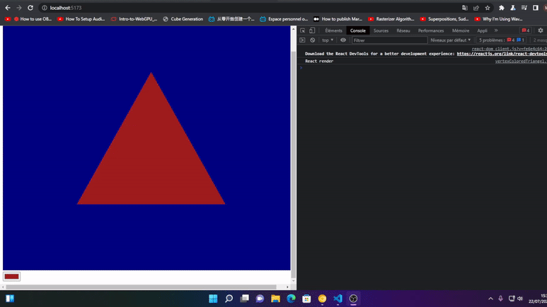

Copyright 2022 Michelangelo Webb. All rights reserved.

| - | MeekloWebb |
|---|---|
| Email |Michelangelo.Webb@gmail.com|
| Github |https://github.com/meeklowebb

# `WebGPU API`

This repository will walk you thorugh the process of drawing 3D graphics on the browser unleashing the power of the GPU.

Also thorugh the code and examples you will learn how to use the GPU to process expensive calculations. So you will be confident implementing these concepts to improve the performance when working on:

- Artificial intelligence
- Deep learning
- Data Sience
- Criptocurrency (Blockchain technologies)
- Mathematic workloads
- 3D Graphics

WebGPU API has not release a stable version ( At the time being July/19/2022 ) and things are expected to change.

Currently, the code only runs on Chrome Canary. I tried to make it work in Ubuntu with Chromium but unfortunatelly I could not.

I have created different versions of the code to get the same result as time goes on, it does not differ too much from old versions though.

***

This repository uses the following techs:

    1. Chrome Canary
    2. TypeScript
    3. Vite
    4. Vitest
    5. React
    6. WebGPU Google Chrome API

The first goal.

Let's start with a simple triangle. To draw a simple triangle youy need to know.

    - How to create an instance of WebGPU
    - Basic knowledge on shader languages
    - Basic syntax on WGSL (WebGPU shader language)
    - Create a view (The Canvas context)
    - Create a pipeline (Configuration stage)
    - Create a command buffer (Drawing stage)
    - Execute the command buffer (Drawing stage)

It may be sounds complicated but you can complete all in a few 100 lines of code. And this 100 lines are the base to do draw anything else. 

The next steap is to make the triangle interactive to achieve:

To achieve interactivity you need to know:

    1. From WebGPU
    - How to get a basic template of WebGPU
    - how to create and load shaders
    - How to create buffers and bind them to the pipeline
    - How a shader reads from the outside world

    2. From the Browser
    - How to create input elements
    - how to create events from your input elements

***

| - | MeekloWebb |
|---|---|
| Email |Michelangelo.Webb@gmail.com|
| Github |https://github.com/meeklowebb

Copyright 2022 Michelangelo Webb. All rights reserved.
