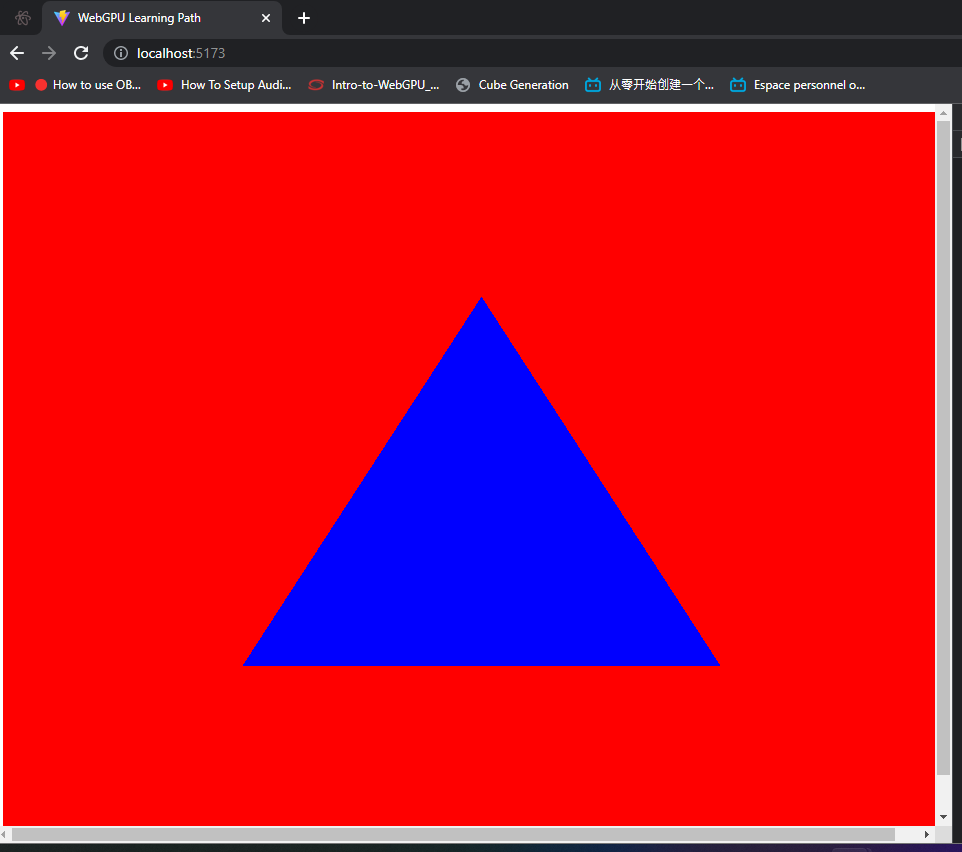

# Simple Trianlge

Following up on this example you can crete a function to draw a simple colored triangle on the screen, and change his color as you prefer.

You must create an `initGPU` function to get the basic setup out of `WebGPU API`.

In the next lessons you will dive deep into the concepts that revolves around GPU processing and how WebGPU handles them.

In short the process to create a triangle using GPU is as follows:

    - Create WebGPU instance.
        It includes
        - Canvas. Logical space on the screen to draw the triangle.
        - Device. Logical connection to a Graphic Card's Processor.
    - Create pipeline (It includes the vertex and fragment shader as strings).
    - Submit our commands to the queue to execute the compiled shaders on the GPU.

Right after callind the `device.queue`, the GPU produces the triangle and puts the image data into the canvas element.

> Do not forget that shaders are programs written in a different programming language that compiles to some binary code  that the GPU Chip understands.
>

Your goal on this tutorial is to draw the following on the browser:

The code can look complicated if you are not familiar with Computer Graphics Definitions but you can learn them throughout these examples.

And algo can visit my medium chanel to get a more in deep explanation of this example.